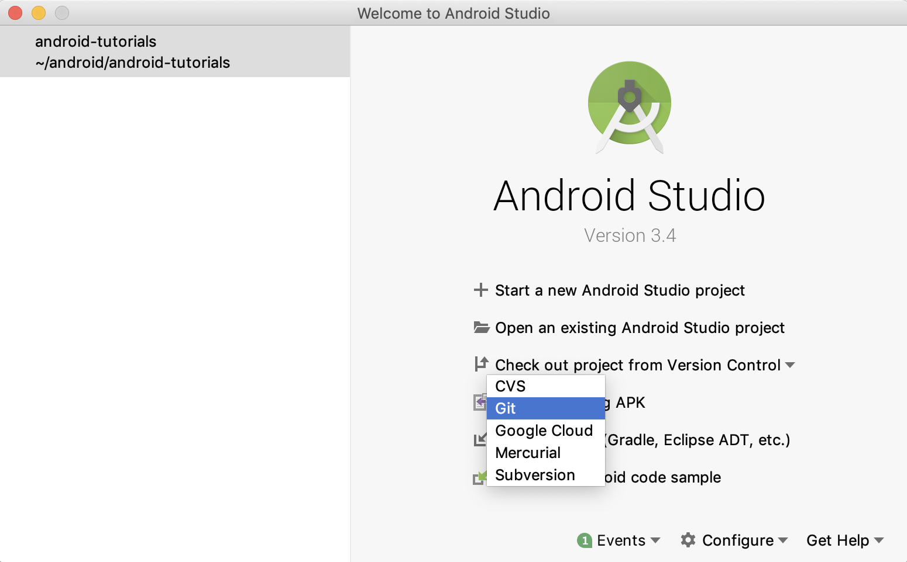
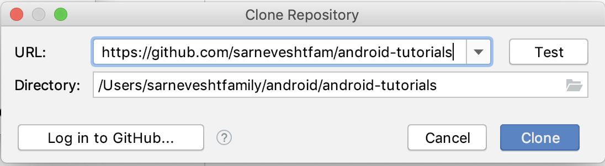
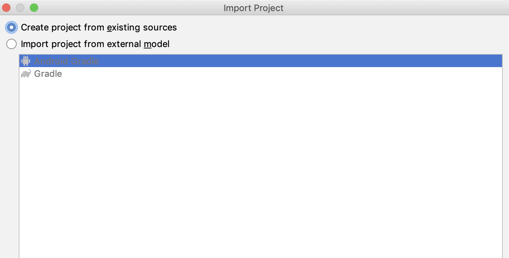
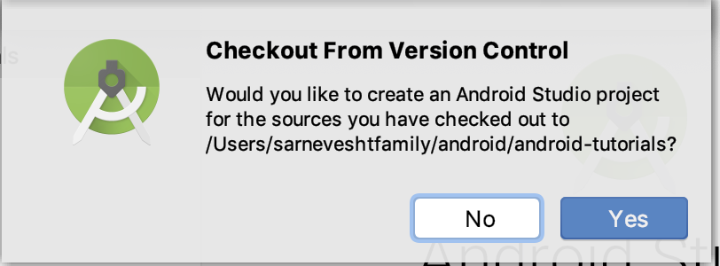

# Android Tutorials

The content in this repository will be mostly based off of the Android tutorial in the following link:
https://www.tutlane.com/tutorial/android/android-tutorial.

The above tutorial is quite comprehensive and you're welcome to explore it, but if you find yourself getting
a bit overwhelmed then in this repository we will try to focus on basic hands-on examples.

From the above tutorial, the following sections are good to skim over for a general idea but you don't need to
delve deeply into them:
(It's ok to skip them for now)

- Android Introduction - What is Android?  https://www.tutlane.com/tutorial/android/android-introduction
- Android Architecture  https://www.tutlane.com/tutorial/android/android-architecture

## Android installation

If you haven't installed Android Developer Studio please do so by following the instructions below:

- Android Development Environment Setup https://www.tutlane.com/tutorial/android/android-development-environment-setup
- Android Studio Installation: https://www.tutlane.com/tutorial/android/android-studio-installation-for-development-environment

## Markdown Navigator by Vladimir Schneider

Readme files (README.md) can be viewed in Android Studio using Markdown Navigator plugin by installing it as follows:

- Go to **Android Studio** -> **Preferences** -> **Plugins**
- Search for **Markdown Navigator**
- Click on **Install**
- **Restart** **Android Studio**
- Use **Markdown Navigator by Vladimir Schneider**

## Android Hello World App Example

The following link explains how to create your first Android app.

https://www.tutlane.com/tutorial/android/android-hello-world-app-example

In the above link, you will learn how to create a new project with an Empty Activity.

**_IMPORTANT_**:  Whenever you create a new project with an Empty Activity, always remember to check the checkbox "use androidx.* artifacts".

You will be exposed to files and concepts which will be explained in more details later.
For now, just try to remember the following pieces, you don't need to understand them in detail now:

 - an **Android layout file**, activity_main.xml (*app/src/main/res/layout/activity_main.xml*),
 - an **Android Main activity file**, MainActivity.java (*app/src/main/java/com/example/androidtutorial/MainActivity.java*)
 - **Android Manifest file**, **AndroidManifest.xml** (*app/src/main/AndroidManifest.xml*)
 - Android emulator
 - running the Android app

**_HINT_**: in Android Studio, use Cmd-Shift-O (or go to "Navigate" -> "File") and type MainActivity.java or activity_main.xml (or any file name) to open a file.

## Clone android-tutorials github repository

At this point, if you haven't done so already, you will need to clone the android-tutorials github repository.

- Open Android Studio

- Select **Checkout project from version control** -> **Git**



- In **Clone Repository** -> type the URL to the android-tutorials github repository



- Select **Create project from existing sources**



- Select **No** when asked "Would you like to create an Android Studio project for the sources you have checked out to ..." 



## Open android-tutorials in Android Studio

Open an existing Android Studio project (or File -> Open) and select **android-tutorials**

In this repository you will find the following projects, each explaining a specific Android feature:

- ui-elements-runtime
- ui-elements-xml
- recyclerview
- search
- firebase
- firebase-search

## Android mobile app

A **mobile app** consists of pages (or screens) containing UI (user interface) elements.

For example, a **mobile app** can have a login page and a home page.  A login page can consist of UI elements like a
text edit box where the user enters his/her username, a password box where the user enters his/her password, and
a button that the user clicks to login.
A home page to the mobile app could have a text box with a description of the app and an image with some nice image.

Following are some common UI elements used in a screen/page which you may recognize:

- TextView
- EditText
- Button
- CheckBox
- RadioButton
- ImageButton
- Progress Bar
- Spinner

## Android Activity

In android, an **Activity** represents a single page with a user interface (UI) of an application.

Generally, the android apps will contain multiple pages and each page of our application will be an extension of Activity class.
By using activities, we can place all our android application UI elements in a single page.

## Android View and ViewGroup with Examples

In android, a **layout** is used to lay out and organize the UI elements in an **activity** (page/screen).
A **layout** will hold the UI elements and will help you in organizing the UI elements.

Following are some examples of layouts:

- Linear Layout
- Relative Layout
- Table Layout
- Frame Layout
- Web View
- List View
- Grid View

take a look at the following link to get an idea of the different layouts:
https://www.tutlane.com/tutorial/android/android-view-and-viewgroup-with-examples

## AndroidX Overview

**AndroidX** is a major improvement to the original Android Support Library.

**_IMPORTANT_**:: Whenever we create a new project, when we select an Empty activity, always check the checkbox "use androidx.* artifacts".

for more information see https://developer.android.com/jetpack/androidx

*******************************************************************************************************************
# Open project 'ui-elements-runtime'
*******************************************************************************************************************

## UI Elements

see https://www.tutlane.com/tutorial/android/android-ui-controls-textview-edittext-radio-button-checkbox

In android, we can define a UI in two ways:

- Create UI elements at runtime
- Declare UI elements in XML

The android framework will allow us to use either or both of these methods to define our application’s UI.

## Create UI Elements at Runtime

To create UI elements at runtime, we need to create our own custom View and ViewGroup objects programmatically with required layouts.

Following is the example of creating an UI elements (TextView, EditText, Button) in LinearLayout using custom View and ViewGroup objects in
an activity programmatically.

*app/src/main/java/com/example/androidtutorial/MainActivity.java*
```
public class MainActivity extends AppCompatActivity {
    @Override
    protected void onCreate(Bundle savedInstanceState) {
        super.onCreate(savedInstanceState);
        LinearLayout linearLayout = new LinearLayout(this);
        TextView textView1 = new TextView(this);
        textView1.setText("Name:");
        EditText editText1 = new EditText(this);
        editText1.setText("Enter Name");
        Button button1 = new Button(this);
        button1.setText("Add Name");
        linearLayout.addView(textView1);
        linearLayout.addView(editText1);
        linearLayout.addView(button1);
        setContentView(linearLayout);
    }
}
```


**_HINT_**: in Android Studio, use Cmd-Shift-O (or go to "Navigate" -> "File") and type MainActivity.java to see the above code, and
run the app.

*******************************************************************************************************************
# Open project 'ui-elements-xml'
*******************************************************************************************************************

## Declare UI elements in XML

In android, a page layout is created in XML similarly as web pages are created in HTML.

The layout file must contain only one root element, which must be a View or ViewGroup object.
Once we define root element, then we can add additional layout objects or widgets as child elements to build the
View hierarchy that defines our layout.

Following is an example of defining some UI elements (TextView, EditText, Button) in an XML file (activity_main.xml)
using LinearLayout.

*app/src/main/res/layout/activity_main.xml*
```
<?xml version="1.0" encoding="utf-8"?>
<LinearLayout xmlns:android="http://schemas.android.com/apk/res/android"
    android:orientation="vertical"

    android:layout_width="match_parent"
    android:layout_height="match_parent">
    <TextView
        android:id="@+id/fstTxt"
        android:layout_width="wrap_content"
        android:layout_height="wrap_content"
        android:text="Enter Name" />
    <EditText
        android:id="@+id/name"
        android:layout_width="wrap_content"
        android:layout_height="wrap_content"
        android:ems="10"/>
    <Button
        android:id="@+id/getName"
        android:layout_width="wrap_content"
        android:layout_height="wrap_content"
        android:text="Get Name" />
</LinearLayout>
```

**_HINT_**: in Android Studio, use Cmd-Shift-O (or go to "Navigate" -> "File") and type activity_main.java to see the above xml code

Also, in file MainActivity.java, method **setContentView(R.layout.activity_main)** is called to **render** the layout file.
Rendering a layout means that the activity will be showing the UI design (with the UI elements) written in the xml file.

In method call **setContentView(R.layout.activity_main)**

- R means Resource

- layout means design

- activity_main is the xml you have created under res->layout->activity_main.xml

For a more detailed explanation of setContentView method, see https://androidride.com/what-setcontentview-android-studio/

**_HINT_**: in Android Studio, use Cmd-Shift-O (or go to "Navigate" -> "File") and type ActivityMain.java to see the above code, and
run the app.

## Constraint layout

The Constraint Layout is worth learning about, once you watch this video and play around with it you may just have
as much fun as I did!

https://www.youtube.com/watch?v=4N4bCdyGcUc

*******************************************************************************************************************
# Open project 'trophies'
*******************************************************************************************************************

## Trophies project

This project was created as an **'empty'** project so you can add code as we go through each tutorial.

In the tutorials we will be learning about:

- **recyclerview**
- **search**
- **firebase**
- **firebase-search**

#### Open project **trophies**

#### Close previous projects ui-elements-runtime and ui-elements-xml

#### Open readme (README.md) file in trophies project

This readme file (README.md) can be viewed in Android Studio using Markdown Navigator plugin by installing it as follows:

- Go to **Android Studio** -> **Preferences** -> **Plugins**
- Search for **Markdown Navigator**
- Click on **Install**
- **Restart** **Android Studio**
- Use **Markdown Navigator by Vladimir Schneider**