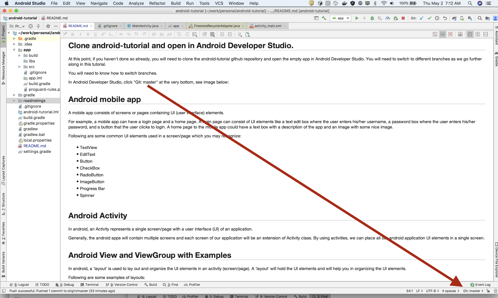

# Android Tutorial

*******************************************************************************************************************
# Switch to branch 'basics'
*******************************************************************************************************************

## Some basics ...

The content in this repository will be mostly based off of the Android tutorial in the following link:
https://www.tutlane.com/tutorial/android/android-tutorial.

The above tutorial is quite comprehensive and you're welcome to explore it, but if you find yourself getting
a bit overwhelmed then in this repository we will try to focus on basic hands-on examples.

From the above tutorial, the following sections are good to skim over for a general idea but you don't need to
delve deeply into them:
(It's ok to skip them for now)

- Android Introduction - What is Android?  https://www.tutlane.com/tutorial/android/android-introduction
- Android Architecture  https://www.tutlane.com/tutorial/android/android-architecture

## Android installation

If you haven't installed Android Developer Studio please do so by following the instructions below:

- Android Development Environment Setup https://www.tutlane.com/tutorial/android/android-development-environment-setup
- Android Studio Installation: https://www.tutlane.com/tutorial/android/android-studio-installation-for-development-environment

## Markdown Navigator by Vladimir Schneider

This readme file (README.md) can be viewed in Markdown Navigator by installing the plugin as follows:

- Go to **Android Studio** -> **Preferences** -> ** Plugins **
- Search for **Markdown Navigator**
- Click on **Install**
- **Restart** **Android Studio**
- Use **Markdown Navigator by Vladimir Schneider**

## Android Hello World App Example

The following link explains how to create your first Android app.

https://www.tutlane.com/tutorial/android/android-hello-world-app-example

In the above link, you will learn how to create a new project with an Empty Activity.

**_IMPORTANT_**:  Whenever you create a new project with an Empty Activity, always remember to check the checkbox "use androidx.* artifacts".

You will be exposed to files and concepts which will be explained in more details later.
For now, just try to remember the following pieces, you don't need to understand them in detail now:

 - an **Android layout file**, activity_main.xml (*app/src/main/res/layout/activity_main.xml*),
 - an **Android Main activity file**, MainActivity.java (*app/src/main/java/com/example/androidtutorial/MainActivity.java*)
 - **Android Manifest file**, **AndroidManifest.xml** (*app/src/main/AndroidManifest.xml*)
 - Android emulator
 - running the Android app

**_HINT_**: in Android Studio, use Cmd-Shift-O (or go to "Navigate" -> "File") and type MainActivity.java or activity_main.xml (or any file name) to open a file.

## Clone android-tutorial and open in Android Developer Studio.

At this point, if you haven't done so already, you will need to clone the android-tutorial github repository and open
the empty app in Android Developer Studio.
You will need to switch to different branches as we go further along in this tutorial.

You will need to know how to switch branches.

In Android Developer Studio, click **Git: master** at the very bottom and you will be able to switch branches, see image below as the arrow points to it:



## Android mobile app

A **mobile app** consists of pages (or screens) containing UI (user interface) elements.

For example, a **mobile app** can have a login page and a home page.  A login page can consist of UI elements like a
text edit box where the user enters his/her username, a password box where the user enters his/her password, and
a button that the user clicks to login.
A home page to the mobile app could have a text box with a description of the app and an image with some nice image.

Following are some common UI elements used in a screen/page which you may recognize:

- TextView
- EditText
- Button
- CheckBox
- RadioButton
- ImageButton
- Progress Bar
- Spinner

## Android Activity

In android, an **Activity** represents a single page with a user interface (UI) of an application.

Generally, the android apps will contain multiple pages and each page of our application will be an extension of Activity class.
By using activities, we can place all our android application UI elements in a single page.

## Android View and ViewGroup with Examples

In android, a **layout** is used to lay out and organize the UI elements in an **activity** (page/screen).
A **layout** will hold the UI elements and will help you in organizing the UI elements.

Following are some examples of layouts:

- Linear Layout
- Relative Layout
- Table Layout
- Frame Layout
- Web View
- List View
- Grid View

take a look at the following link to get an idea of the different layouts:
https://www.tutlane.com/tutorial/android/android-view-and-viewgroup-with-examples

## AndroidX Overview

**AndroidX** is a major improvement to the original Android Support Library.

**_IMPORTANT_**:: Whenever we create a new project, when we select an Empty activity, always check the checkbox "use androidx.* artifacts".

for more information see https://developer.android.com/jetpack/androidx

*******************************************************************************************************************
# Switch to branch 'ui-elements-runtime'
*******************************************************************************************************************

## UI Elements

see https://www.tutlane.com/tutorial/android/android-ui-controls-textview-edittext-radio-button-checkbox

In android, we can define a UI in two ways:

- Create UI elements at runtime
- Declare UI elements in XML

The android framework will allow us to use either or both of these methods to define our application’s UI.

## Create UI Elements at Runtime

To create UI elements at runtime, we need to create our own custom View and ViewGroup objects programmatically with required layouts.

Following is the example of creating an UI elements (TextView, EditText, Button) in LinearLayout using custom View and ViewGroup objects in
an activity programmatically.

*app/src/main/java/com/example/androidtutorial/MainActivity.java*
```
public class MainActivity extends AppCompatActivity {
    @Override
    protected void onCreate(Bundle savedInstanceState) {
        super.onCreate(savedInstanceState);
        LinearLayout linearLayout = new LinearLayout(this);
        TextView textView1 = new TextView(this);
        textView1.setText("Name:");
        EditText editText1 = new EditText(this);
        editText1.setText("Enter Name");
        Button button1 = new Button(this);
        button1.setText("Add Name");
        linearLayout.addView(textView1);
        linearLayout.addView(editText1);
        linearLayout.addView(button1);
        setContentView(linearLayout);
    }
}
```


**_HINT_**: in Android Studio, use Cmd-Shift-O (or go to "Navigate" -> "File") and type MainActivity.java to see the above code, and
run the app.

*******************************************************************************************************************
# Switch to branch 'ui-elements-xml'
*******************************************************************************************************************

## Declare UI elements in XML

In android, a page layout is created in XML similarly as web pages are created in HTML.

The layout file must contain only one root element, which must be a View or ViewGroup object.
Once we define root element, then we can add additional layout objects or widgets as child elements to build the
View hierarchy that defines our layout.

Following is an example of defining some UI elements (TextView, EditText, Button) in an XML file (activity_main.xml)
using LinearLayout.

*app/src/main/res/layout/activity_main.xml*
```
<?xml version="1.0" encoding="utf-8"?>
<LinearLayout xmlns:android="http://schemas.android.com/apk/res/android"
    android:orientation="vertical"

    android:layout_width="match_parent"
    android:layout_height="match_parent">
    <TextView
        android:id="@+id/fstTxt"
        android:layout_width="wrap_content"
        android:layout_height="wrap_content"
        android:text="Enter Name" />
    <EditText
        android:id="@+id/name"
        android:layout_width="wrap_content"
        android:layout_height="wrap_content"
        android:ems="10"/>
    <Button
        android:id="@+id/getName"
        android:layout_width="wrap_content"
        android:layout_height="wrap_content"
        android:text="Get Name" />
</LinearLayout>
```

**_HINT_**: in Android Studio, use Cmd-Shift-O (or go to "Navigate" -> "File") and type activity_main.java to see the above xml code

Also, in file MainActivity.java, method **setContentView(R.layout.activity_main)** is called to **render** the layout file.
Rendering a layout means that the activity will be showing the UI design (with the UI elements) written in the xml file.

In method call **setContentView(R.layout.activity_main)**

- R means Resource

- layout means design

- activity_main is the xml you have created under res->layout->activity_main.xml

For a more detailed explanation of setContentView method, see https://androidride.com/what-setcontentview-android-studio/

**_HINT_**: in Android Studio, use Cmd-Shift-O (or go to "Navigate" -> "File") and type ActivityMain.java to see the above code, and
run the app.

## Constraint layout

The Constraint Layout is worth learning about, once you watch this video and play around with it you may just have
as much fun as I did!

https://www.youtube.com/watch?v=4N4bCdyGcUc

*******************************************************************************************************************
# Switch to branch 'recyclerview'
*******************************************************************************************************************

## RecyclerView

Android **RecyclerView** is the advanced version of ListView for more improvements and features.

- Go to **_activity_main.xml_**, open the **Design** tab, and in **Palete** -> **Containers** you will find the **RecyclerView**.
- Drag it to the Contraint Layout.
- You will be asked if you want to add the library to project dependencies, click **Ok**.  When you do, the library will be added to the app/build.gradle file.

The page that we are going to design contains our trophies information with **RecyclerView**.

#### Create a class Trophy.java with getter/setter methods for each row in RecyclerView.
see *src/main/java/com/example/androidtutorial/**Trophy.java***.

#### Create a layout for RecyclerView item row trophies_item_row.xml.
see *src/main/res/layout/**trophies_item_row.xml***.

#### Now create adapter class TrophyAdapter.java step-wise for recyclerview base.
Follow these steps to easily create the adapter without any complex structure.
Below steps are for RecyclerView adapter class.

1. Create class **TrophyAdapter**

*app/src/main/java/com/example/androidtutorial/**TrophyAdapter.java***
```
    public class TrophyAdapter {
    }
```

2. Create **ViewHolder** for RecyclerView

*app/src/main/java/com/example/androidtutorial/**TrophyHolder.java***
```
    public class TrophyHolder extends RecyclerView.ViewHolder {
        private TextView txtTitle;
        private TextView txtDescription;

        public TrophyHolder(View itemView) {
          super(itemView);
          txtTitle = itemView.findViewById(R.id.txtTitle);
          txtDescription = itemView.findViewById(R.id.txtDescription);
        }
    }
```


3. Extend adapter **TrophyAdapter** class to **RecyclerView.Adapter<TrophyHolder>** and
   implement override methods **onCreateViewHolder**, **onBindViewHolder** and **getItemCount**.

(see *src/main/java/com/example/androidtutorial/**TrophyAdapter.java***)

4. Define context and trophies ArrayList and create a constructor.

(src/main/java/com/example/androidtutorial/**TrophyAdapter.java**)
```
    private Context context;
    private ArrayList<Trophy> trophies;

    public TrophyAdapter(Context context, ArrayList<Trophy> trophies) {
        this.context = context;
        this.trophies = trophies;
    }
```

5. Change **getItemCount()** method

*app/src/main/java/com/example/androidtutorial/**TrophyAdapter.java***
```
    @Override
    public int getItemCount() {
          return trophies.size();
    }
```

6. Inflate item layout in **onCreateViewHolder()** method and inflate **trophies_item_row** for the recyclerview.

**_NOTE_**: **Inflate** means to **render** or **show** the page for each trophy row item in the recyclerview list.

*app/src/main/java/com/example/androidtutorial/**TrophyAdapter.java***
```
    @Override
    public TrophyHolder onCreateViewHolder(ViewGroup parent, int viewType) {
         View view = LayoutInflater.from(context).inflate(R.layout.trophies_item_row, parent, false);
         return new TrophyHolder(view);
    }
```

7. Create a method in **TrophyHolder** class to set values for each trophy row item in the recyclerview list.

*app/src/main/java/com/example/androidtutorial/**TrophyAdapter.java***
```
    public void setDetails(Trophy trophy) {
        txtTitle.setText(trophy.getTrophyTitle());
        txtDescription.setText(trophy.getTrophyDescription());
    }
```

8. Call method **onBindViewHolder()** method to bind the trophy row item of recyclerview

*app/src/main/java/com/example/androidtutorial/**TrophyAdapter.java***
```
    @Override
    public void onBindViewHolder(TrophyHolder holder, int position) {
     Trophy trophy = trophies.get(position);
     holder.setDetails(trophy);
    }
```

#### Now change your activity code to do the following (see src/main/java/com/example/androidtutorial/MainActivity.java):

    - set recyclerview layout manager
    - set adapter for recyclerview
    - fill data for recyclerview items
    - set data to adapter and notify data

The LayoutManager is responsible for measuring and positioning item views within the recyclerview as well as
determining the policy for when to recycle item views that are no longer visible to the user.
By changing the layout manager, recyclerview can be used to implement a standard vertically scrolling list,
a uniform grid, staggered grids, horizontally scrolling collections and more.

*******************************************************************************************************************
# Switch to branch 'search'
*******************************************************************************************************************

## Search

We will be using **MaterialSearchbar** from https://github.com/mancj/MaterialSearchBar

Additionally, we will be adding search functionality to existing RecyclerView code from the RecyclerView lesson in branch **recycleview**
https://github.com/csarnevesht/android-tutorial/tree/recyclerview

#### Go to res/layout/activity_main.xml, open the "Text" tab, and see the added Toolbar and Material Search bar as follows:

*app/src/main/res/layout/**activity_main.xml***
```
      <com.mancj.materialsearchbar.MaterialSearchBar
             android:id="@+id/searchBar"
             style="@style/MaterialSearchBarLight"
             android:layout_width="0dp"
             android:layout_height="48dp"
             android:layout_marginStart="8dp"
             android:layout_marginTop="8dp"
             android:layout_marginEnd="8dp"
             android:elevation="8dp"
             app:mt_placeholder=""
             app:layout_constraintEnd_toEndOf="parent"
             app:layout_constraintHorizontal_bias="0.0"
             app:layout_constraintStart_toStartOf="parent"
             app:layout_constraintTop_toTopOf="parent"
             app:mt_maxSuggestionsCount="10"
             app:mt_speechMode="false">
         </com.mancj.materialsearchbar.MaterialSearchBar>

         <androidx.recyclerview.widget.RecyclerView
             android:id="@+id/recyclerView"
             android:layout_width="395dp"
             android:layout_height="635dp"
             android:layout_marginStart="8dp"
             android:layout_marginTop="8dp"
             android:layout_marginEnd="8dp"
             android:layout_marginBottom="8dp"
             app:layout_constraintBottom_toBottomOf="parent"
             app:layout_constraintEnd_toEndOf="parent"
             app:layout_constraintStart_toStartOf="parent"
             app:layout_constraintTop_toBottomOf="@+id/searchBar" />
```

#### Now change your activity code to do the following (see src/main/java/com/example/androidtutorial/MainActivity.java):

1. Declare the search bar in the **MainActivity** class:

*app/src/main/java/com/example/androidtutorial/**MainActivity.java***
```
    private MaterialSearchBar searchBar;

```

2. Add the following to the **MainActivity** class:

*app/src/main/java/com/example/androidtutorial/**MainActivity.java***
```
   public class MainActivity extends AppCompatActivity {

       private MaterialSearchBar searchBar;

       @Override
           protected void onCreate(Bundle savedInstanceState) {

           ...
           searchBar = findViewById(R.id.searchBar);

           searchBar.addTextChangeListener(new TextWatcher() {
               @Override
               public void beforeTextChanged(CharSequence charSequence, int i, int i1, int i2) {
               }

               @Override
               public void onTextChanged(CharSequence charSequence, int i, int i1, int i2) {
                   Log.d("LOG_TAG", getClass().getSimpleName() + " text changed " + searchBar.getText());
                   doSearch(searchBar.getText());

               }

               @Override
               public void afterTextChanged(Editable editable) {
                   Log.d("LOG_TAG", getClass().getSimpleName() + " after text changed " + searchBar.getText());
                   doSearch(searchBar.getText());

               }

           });

           searchBar.enableSearch();
       }

       // search data
       private void doSearch(String searchText) {
           Log.d("LOG_TAG", getClass().getSimpleName() + " doSearch " + searchBar.getText());

           adapter.getFilter().filter(searchText);
           adapter.notifyDataSetChanged();

       }

```


*******************************************************************************************************************
# Switch to branch 'firebase'
*******************************************************************************************************************

## Firebase

We will be adding **Firebase** functionality to existing RecyclerView and search code from the search lesson in branch **search**
https://github.com/csarnevesht/android-tutorial/tree/search

#### Add Firebase to your Android project

Follow instructions in https://firebase.google.com/docs/android/setup

#### Upload trophy images to 'Firebase Storage'

1. Open the Firebase **console** on the browser at https://console.firebase.google.com
2. Click on the **android-tutorial** project
3. Click **Storage** from the left menu
4. Click on the **Files** tab
5. Click **Upload file** and upload trophy images from **android-tutorial/images**

#### Define Storage Rules

1. Click on the **Rules** tab
2. Define Rules as follows:

```
    service firebase.storage {
     match /b/{bucket}/o {
      match /{allPaths=**} {
         allow read, write: if true;
        }
    }
    }
```

#### Create trophy records in 'Cloud Firestore'

1. Open the Firebase **console** on the browser at https://console.firebase.google.com
2. Click on the **android-tutorial** project
3. Click **Database** from the left menu
4. Select **Database** -> **Cloud Firestore**
5. Click on the **Data** tab
6. Add data as follows:


**_IMPORTANT_**: To get the URL of an image:
 - go to Firebase **Storage**
 - click on the uploaded image,
 - under File location, click **Download Url**, it will be copied into the clipboard which can then be pasted in the **Cloud Firestore** **image** field.


#### Add Firebase dependencies to module app build.gradle:

*app/build.gradle*
```
    dependencies {

        ...

        //picasso library to retrieve images
        implementation 'com.squareup.picasso:picasso:2.71828'

        // Firebase core
        implementation 'com.google.firebase:firebase-core:16.0.8'

        // Cloud Firestore
        // see https://firebase.google.com/docs/android/setup#available-libraries
        implementation 'com.google.firebase:firebase-firestore:18.2.0'

        // FirebaseUI for Cloud Firestore
        // Used for FirestoreRecyclerAdapter
        // see https://firebaseopensource.com/projects/firebase/firebaseui-android/firestore/readme.md/
        implementation 'com.firebaseui:firebase-ui-firestore:4.3.1'
        ...
    }
```

Note: see https://firebase.google.com/docs/android/setup#available-libraries

#### Connect to Firebase Database Cloud Firestore

1. In **MainActivity.java** add code to access a **Cloud Firestore** instance from the activity and create a reference to the **Data** collection:

*app/src/main/java/com/example/androidtutorial/**MainActivity.java***
```
    public class MainActivity extends AppCompatActivity {

       ...
       FirebaseFirestore mFirebaseDatabase;
       CollectionReference mRef;


        @Override
        protected void onCreate(Bundle savedInstanceState) {
           super.onCreate(savedInstanceState);
           setContentView(R.layout.activity_trophies_list);

           // Access a Cloud Firestore instance from your Activity
           mFirebaseDatabase = FirebaseFirestore.getInstance();
           mRef = mFirebaseDatabase.collection("Data");

           ...
        }

```

2. In **MainActivity.java** remove method **createListData()**, since we will now be getting the data from the **FirestoreRecyclerAdapter** which will get the data from the **Data** in **Cloud Firestore**.

3. In **TrophyAdapter.java** replace the class parent to **FirestoreRecyclerAdapter<Trophy, TrophyHolder>** and implement methods **onCreateViewHolder**, **onBindViewHolder** and the following **constructor** :

*app/src/main/java/com/example/**TrophyAdapter.java***
```
    public class TrophyAdapter extends FirestoreRecyclerAdapter<Trophy, TrophyHolder>  {

        public TrophyAdapter(@NonNull FirestoreRecyclerOptions<Trophy> options, Context context, ArrayList<Trophy> trophies) {
            super(options);
        }

        @Override
        public TrophyHolder onCreateViewHolder(ViewGroup parent, int viewType) {
            View view = LayoutInflater.from(parent.getContext()).inflate(R.layout.trophies_item_row, parent, false);
            TrophyHolder viewHolder = new TrophyHolder(view);
            return viewHolder;
        }

        @Override
        protected void onBindViewHolder(@NonNull TrophyHolder trophyHolder, int position, @NonNull Trophy trophy) {
            trophyHolder.setDetails(trophy);
        }
    }
```

3. In **TrophyAdapter.java** remove method **getFilter()**, and in **MainActivity.java** remove the call to **getFilter()**, since the filter will now be done by the **FirestoreRecyclerAdapter**.

4. In **MainActivity.java** add the following code which uses **FirestoreRecyclerOptions**, and **TrophyAdapter** (**FirestoreRecyclerAdapter**) to query the **Cloud Firestore**:

*app/src/main/java/com/example/androidtutorial/**MainActivity.java***
```
    // search data
    private void doSearch(String searchText) {
        Log.d("LOG_TAG", getClass().getSimpleName() + " doSearch " + searchBar.getText());

        //convert string entered in SearchView to lowercase
        String query = searchText.toLowerCase();
        Query firebaseSearchQuery = mRef.whereArrayContains("search", query);
        FirestoreRecyclerOptions<Trophy> options = new FirestoreRecyclerOptions.Builder<Trophy>()
                .setQuery(query.isEmpty() ?  mRef : firebaseSearchQuery, Trophy.class)
                .build();
        adapter = new TrophyAdapter(options,this, trophyArrayList);
        // set adapter for recyclerview
        recyclerView.setAdapter(adapter);
        // CLOUD FIRESTORE
        // start listening for recyclerview items from firestore
        adapter.startListening();
    }
```

*******************************************************************************************************************
# Switch to branch 'master'
*******************************************************************************************************************